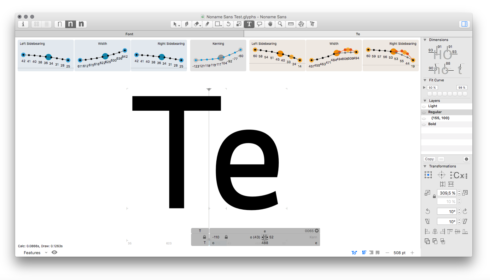

# Space Bar 30-day Trial

**Space Bar** is a plug-in for the popular type design application [Glyphs.app](http://glyphsapp.com) that gives you a lot more insight into the spacing of your font. It is particularly handy for working on a font with multiple masters.

All infos here: [https://yanone.de/software/spacebar/](https://yanone.de/software/spacebar/)

This page hosts the 30-day trial version of the plug-in to be installed via Glyphs’ Plugin Manager. The paid version will later be available via my online shop.
